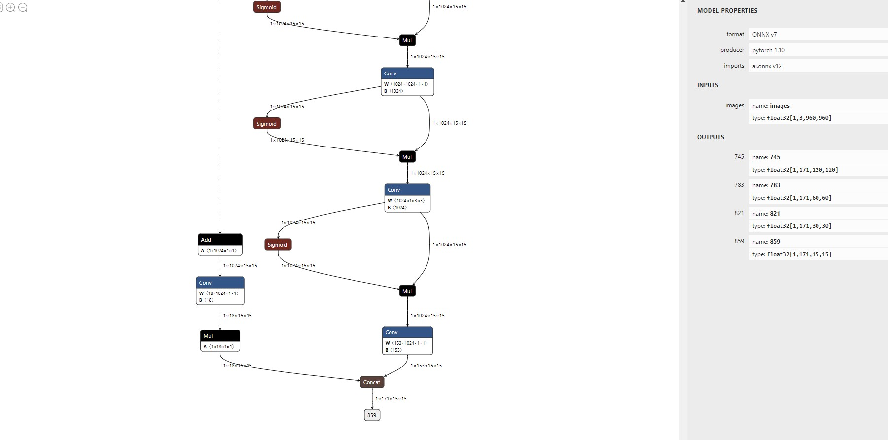
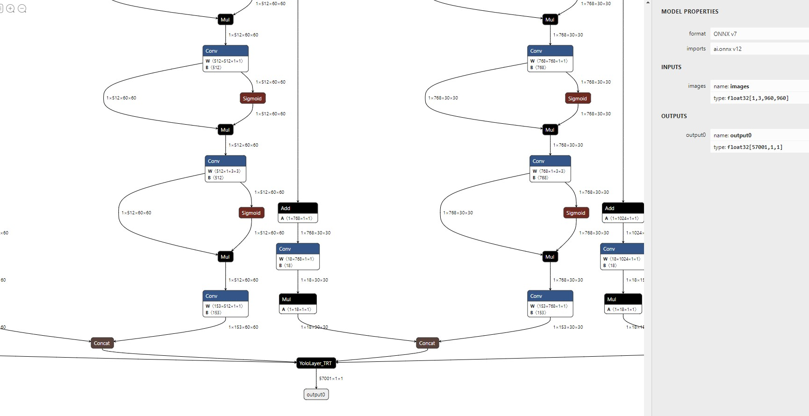
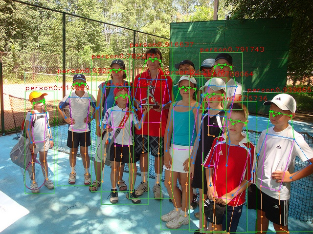

<!--

 * @Description: YOLOv7 Pose TensorRT
 * @Author: nanmi
 * @Date: 2022-08-03 16:55:35
 * @LastEditTime: 2022-08-12 09:36:35
 * @LastEditors: nanmi
 * @GitHub:github.com/nanmi
   -->

# Pose detection base on Yolov7 Deploy TensorRT :two_hearts: :collision:

This project base on https://github.com/WongKinYiu/yolov7


# System Requirements

cuda 11.4

TensorRT 8+

OpenCV 4.0+ (build with opencv-contrib module) [how to build](https://gist.github.com/nanmi/c5cc1753ed98d7e3482031fc379a3f3d#%E6%BA%90%E7%A0%81%E7%BC%96%E8%AF%91gpu%E7%89%88opencv)

# Export onnx model
Need to shield reshap and permute operators like this in the keypoint-related code `class IKeypoint(nn.Module)`
```python
    def forward(self, x):
        # x = x.copy()  # for profiling
        z = []  # inference output
        self.training |= self.export
        for i in range(self.nl):
            if self.nkpt is None or self.nkpt==0:
                x[i] = self.im[i](self.m[i](self.ia[i](x[i])))  # conv
            else :
                x[i] = torch.cat((self.im[i](self.m[i](self.ia[i](x[i]))), self.m_kpt[i](x[i])), axis=1)

            if not self.training:  # inference <------ new add
                bs, _, ny, nx = x[i].shape  # x(bs,255,20,20) to x(bs,3,20,20,85)
                x[i] = x[i].view(bs, self.na, self.no, ny, nx).permute(0, 1, 3, 4, 2).contiguous()
                x_det = x[i][..., :6]
                x_kpt = x[i][..., 6:]

            if not self.training:  # inference
                if self.grid[i].shape[2:4] != x[i].shape[2:4]:
                    self.grid[i] = self._make_grid(nx, ny).to(x[i].device)
                kpt_grid_x = self.grid[i][..., 0:1]
                kpt_grid_y = self.grid[i][..., 1:2]
                ...
```

use this script to export onnx model.
```python
import sys
sys.path.append('./')  # to run '$ python *.py' files in subdirectories
import torch
import torch.nn as nn
import models
from models.experimental import attempt_load
from utils.activations import Hardswish, SiLU

# Load PyTorch model
weights = 'yolov7-w6-pose.pt'
device = torch.device('cuda:0')
model = attempt_load(weights, map_location=device)  # load FP32 model

# Update model
for k, m in model.named_modules():
    m._non_persistent_buffers_set = set()  # pytorch 1.6.0 compatibility
    if isinstance(m, models.common.Conv):  # assign export-friendly activations
        if isinstance(m.act, nn.Hardswish):
            m.act = Hardswish()
        elif isinstance(m.act, nn.SiLU):
            m.act = SiLU()
model.model[-1].export = True # set Detect() layer grid export
model.eval()

# Input
img = torch.randn(1, 3, 960, 960).to(device)  # image size(1,3,320,192) iDetection
torch.onnx.export(model, img, 'yolov7-w6-pose.onnx', verbose=False, opset_version=12, input_names=['images'])
```

you will get:


use `YoloLayer_TRT_v7.0/script/add_custom_yolo_op.py` to add a new op lookes like this:

 


# Build yolo layer tensorrt plugin

```shell
cd {this repo}/YoloLayer_TRT_v7.0
mkdir build && cd build
cmake .. && make
```

generate `libyolo.so` when build successfully.

# Build TensorRT engine

```shell
cd {this repo}/

trtexec --onnx=yolov7-w6-pose-sim-yolo.onnx --fp16 --saveEngine=yolov7-w6-pose-sim-yolo-fp16.engine --plugins={this repo}/YoloLayer_TRT_v7.0/build/libyolo.so
```

wait a long time :satisfied:

TensorRT engine is generated successfully.


# Inference

```shell
cd {this repo}/yolov7-pose/
mkdir build && cd build
cmake .. && make 

# Inference test
cd {this repo}/yolov7-pose/build/
./yolov7_pose -d {your build engine} ../person.jpg
```

# Result


# About License

For the 3rd-party module and TensorRT, you need to follow their license

For the part I wrote, you can do anything you want

